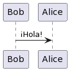

1. Crear un proyecto nuevo:
    a. Pasos previos: 
        a1. Instala node        => https://nodejs.org/en/download/
        a2. Instala typescrypt  => npm install -g typescript (global)
                                => npm install --save-dev typescript (local - recomendado como paso b1)
        a3. Instalar ts-node    => npn install ts-node (global) #para correr archivos .ts sin compilar a js
                                => npm install --save-dev ts-node (local - recomendado como paso b2)
    b. Iniciar proyecto         => npm init o npm init -y #acepta valores default y salta preguntas
    c. Inicializar typescript   => tsc --init #esto crea un archivo tsconfig.json
    d. Instalar tipos Node.js   =>  npm install --save-dev @types/node #esto ayuda a que se entiedan funciones y objetos especificos de Node.js
2. Correr un archivo:
    a. Compilar y ejecutar      => tsc archivo.ts #esto crea el archivo archivo.js
                                => node archivo.js
    b. Correr directamente      => npx ts-node archivo.ts


Regular **Markdown** here.


<details>

```
@startuml firstDiagram

Alice -> Bob: Hello
Bob -> Alice: Hi!
		
@enduml
```

</details>


